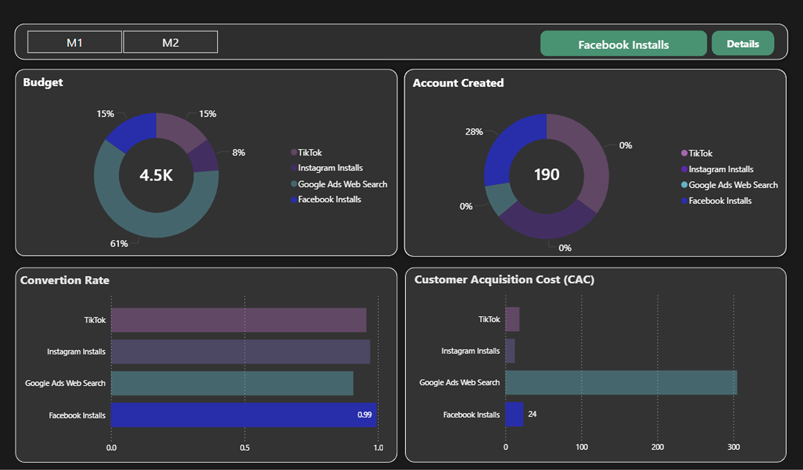
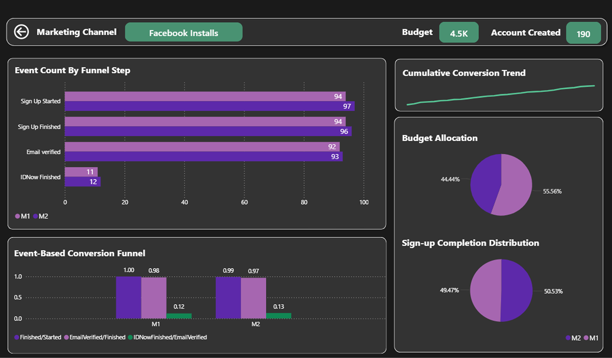
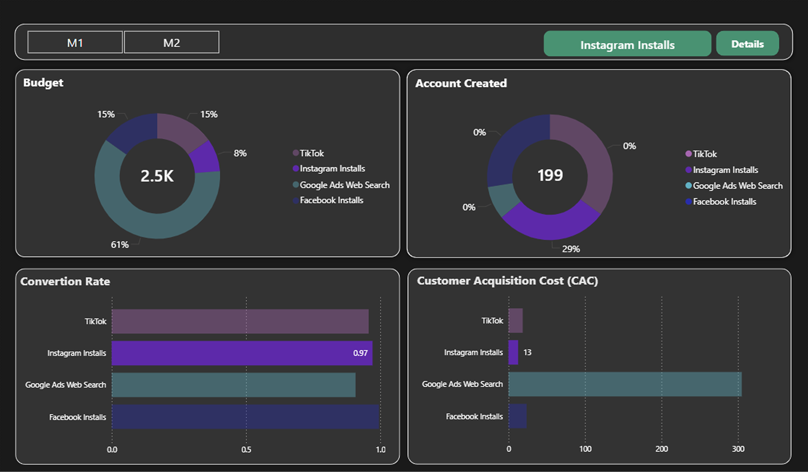
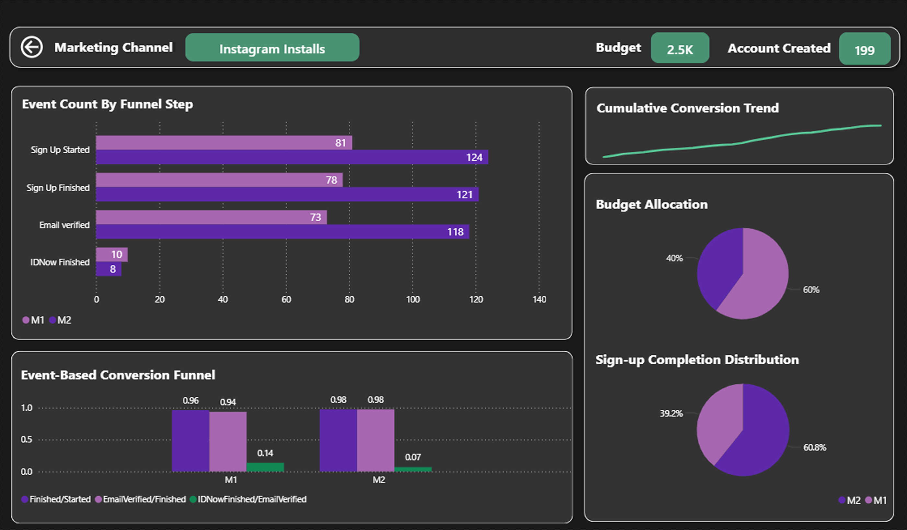
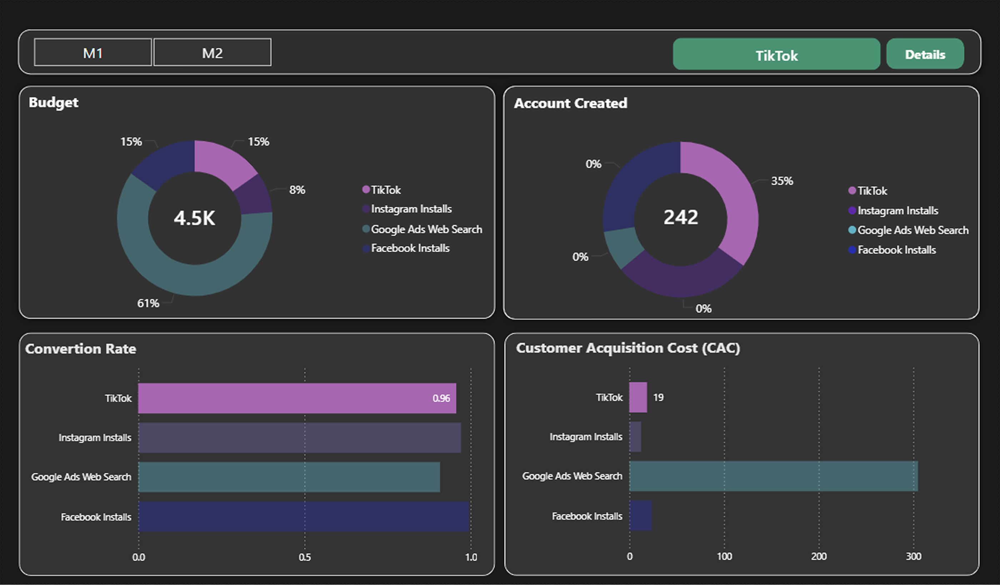
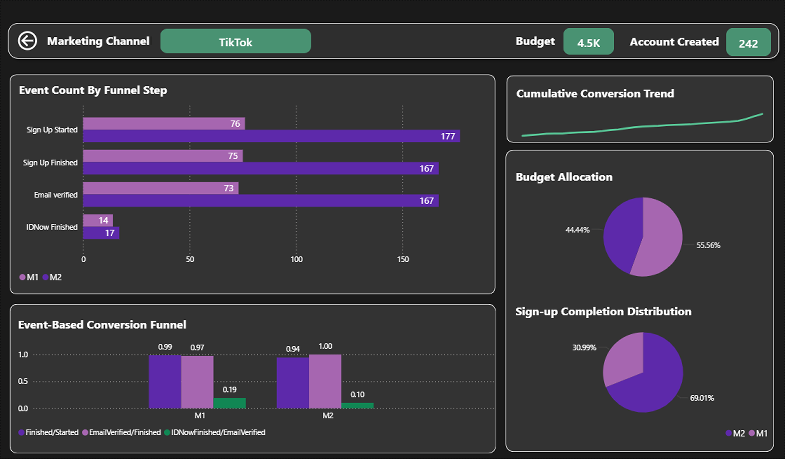
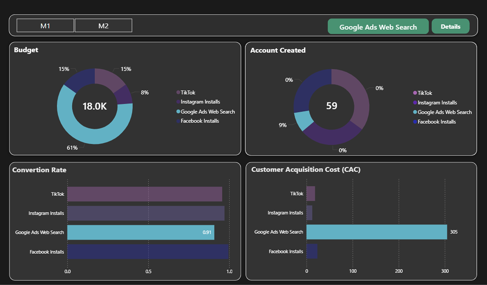
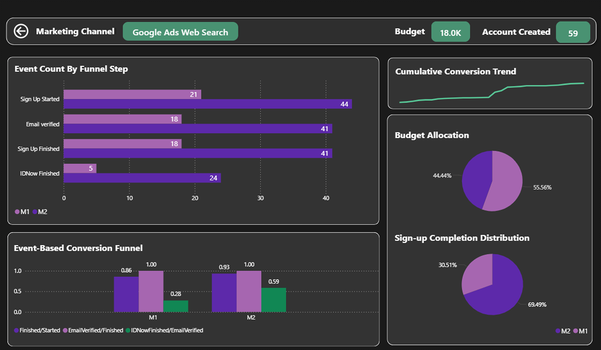
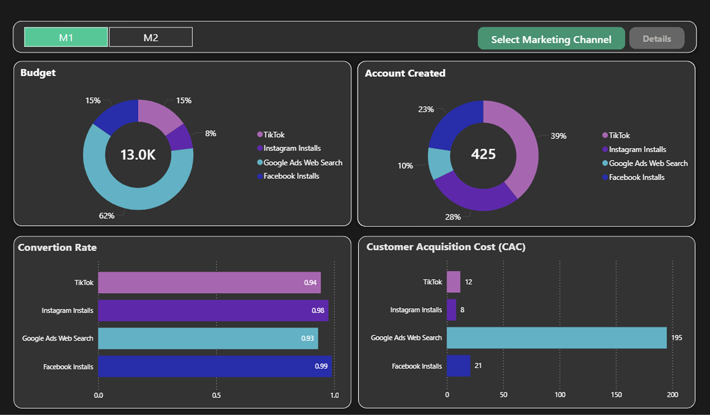
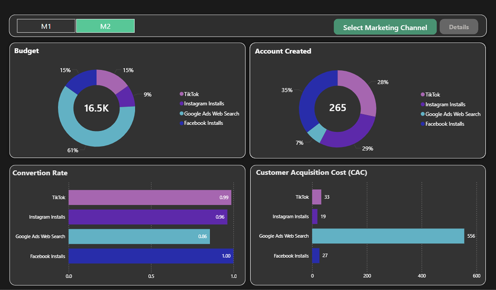

# Marketing Performance Dashboard


## Project Overview

End-to-end BI case study analyzing marketing campaign performance using SQL Server and Power BI.

The goal of this project is to analyze marketing funnel performance, channel efficiency, customer acquisition cost, and budget allocation.

## Technologies Used

- SQL Server
- Power BI
- Excel
- SQL Analytics
- Business Intelligence


## Business Context

Marketing teams invest significant budgets across multiple acquisition channels, but determining which channels deliver the highest value requires more than tracking total conversions.

This project analyzes event-level marketing data to evaluate user behavior throughout the acquisition funnel, compare channel performance, and measure customer acquisition efficiency. The analysis combines user tracking events with marketing budget data to identify conversion bottlenecks, optimize spending, and support data-driven marketing decisions.

## Key Business Questions

The dashboard was designed to answer the following business questions:

- How should raw tracking events be consolidated into a reliable user-level dataset?
- How many users progress through each stage of the marketing funnel?
- At which funnel stage do the highest user drop-offs occur?
- Which marketing channel delivers the best acquisition efficiency?
- Which channel has the highest Customer Acquisition Cost (CAC)?
- How should future marketing budgets be allocated based on performance?

## Dataset

The dataset contains marketing tracking events and campaign budget information used to evaluate acquisition performance across multiple marketing channels.

It includes:

- Event-based user tracking data
- Marketing channel information (Facebook, Instagram, TikTok, and Google Ads)
- Marketing budget by reporting period
- User journey events across the signup funnel
- Two reporting periods:
  - **M1:** 01–14 October **M2:** 15–31 October


The data was designed to simulate a real-world digital marketing analytics environment for business intelligence reporting.

## Data Preparation & Quality Checks

The raw marketing tracking data was imported into SQL Server for cleaning, validation, and analysis.

The data preparation process included:

* Importing Excel tracking data into SQL Server
* Checking duplicate user records
* Identifying missing or invalid User Keys
* Validating event sequences within the user journey
* Applying funnel logic to create a reliable user-level dataset
* Event timestamps were analyzed using minimum and maximum event times to validate user progression through the signup funnel.

### Data Quality Results

| Validation Check               | Result |
| ------------------------------ | -----: |
| Total Users                    |  3,731 |
| Users without valid User Key   |    807 |
| Invalid event sequences        |    743 |
| Duplicate User Key cases       |      1 |
| Valid users used for dashboard |  2,180 |

Only validated users were included in the final dashboard analysis to ensure accurate reporting of funnel and channel performance.


## Event Funnel

The analysis follows the complete user acquisition journey from initial signup interaction to completed identity verification.

The funnel consists of four key stages:

1. Signup Started
2. Signup Finished
3. Email Verified
4. ID Verification Finished

Each event was validated and consolidated at the user level to measure conversion rates and identify major drop-off points throughout the acquisition process.


## Marketing Performance KPIs

### Customer Acquisition Cost (CAC)

**Business Meaning:**  
Measures the cost required to acquire one new user through marketing activities.

**Formula:**

`CAC = Marketing Spend / Acquired Users`


---

### Funnel Conversion Rate

**Business Meaning:**  
Measures the percentage of users who successfully progress through the complete signup funnel.

**Formula:**

`Conversion Rate = Completed Funnel Users / Started Funnel Users`


---

### Account Creation Rate

**Business Meaning:**  
Measures the percentage of users who complete account creation after starting signup.

**Formula:**

`Account Creation Rate = Signup Finished Users / Signup Started Users`


---

### Funnel Drop-off Rate

**Business Meaning:**  
Measures user loss between two consecutive funnel stages.

**Formula:**

`Drop-off Rate = Users Lost Between Steps / Previous Funnel Step Users`

## SQL Solution

SQL Server was used to transform raw marketing tracking events into a structured dataset for funnel and channel performance analysis.

The SQL analysis included:

* Data quality validation
* User-level event consolidation
* Funnel stage calculation
* Marketing channel performance analysis
* Customer Acquisition Cost (CAC) calculation
* Conversion rate analysis

The project uses analytical SQL techniques including:

* Common Table Expressions (CTEs)
* SELECT DISTINCT for user-level consolidation
* GROUP BY and HAVING for aggregation and validation checks
* CASE statements for funnel logic
* UNION for combining analytical datasets
* MIN/MAX timestamp functions to validate event sequences
* Filtering and conditional logic

These queries were designed to clean tracking data, validate user journeys, calculate funnel metrics, and prepare reliable datasets for Power BI reporting.


## Power BI Dashboard

The Power BI dashboard was developed to analyze marketing channel performance, user funnel progression, and customer acquisition efficiency.

The dashboard consists of two main pages:

#### Marketing Overview

The first dashboard page provides a high-level view of marketing performance, including:

* Marketing budget distribution by channel
* Funnel Conversion Rate
* Account Created Rate
* Customer Acquisition Cost (CAC)
* Channel performance comparison
* M1 and M2 period filtering

#### Channel Detail Analysis

The second dashboard page provides a detailed breakdown for each marketing channel, including:

* Funnel event counts
* Funnel progression from signup to ID verification
* Cumulative conversion trend
* Budget allocation by reporting period
* Signup completion distribution
* Channel performance comparison

## Dashboard Gallery

### Marketing Overview


### Channel Analysis

#### Facebook






#### Instagram






#### TikTok






#### Google Ads






### Period Comparison

#### M1 vs M2






## Business Insights & Recommendations


### 1. Google Ads received the largest budget share but showed the lowest acquisition efficiency.

Google Ads accounted for approximately 61% of total marketing spend but generated only 9% of created accounts. The channel also recorded the highest Customer Acquisition Cost (CAC), significantly higher than other marketing channels.

This indicates that the current Google Ads investment level is not aligned with acquisition performance.

**Recommendation**

Review Google Ads campaign structure, audience targeting, bidding strategy, and keyword performance before increasing future investment. Budget should be shifted toward campaigns that demonstrate stronger acquisition efficiency.


---

### 2. Instagram delivered the strongest cost efficiency among marketing channels.

Instagram received a relatively small share of the total budget while achieving one of the lowest CAC values and maintaining a high conversion rate throughout both reporting periods.

The channel demonstrated the ability to acquire users efficiently with limited budget allocation.

**Recommendation**

Consider gradually increasing Instagram investment while monitoring whether CAC remains stable as spending increases.


---

### 3. TikTok generated strong user acquisition volume with competitive performance.

TikTok produced the highest share of created accounts while maintaining strong funnel conversion performance. Although CAC increased in M2 compared with M1, the channel continued to generate significant acquisition volume.

**Recommendation**

Continue investing in TikTok while optimizing campaign targeting and creative performance to maintain acquisition efficiency as budget scales.


---

### 4. Facebook showed strong funnel completion performance.

Facebook achieved consistently high conversion rates across reporting periods, indicating strong user progression through the signup journey. However, its acquisition efficiency should be evaluated together with CAC and total acquisition volume.

**Recommendation**

Maintain Facebook investment while testing opportunities to improve acquisition volume and reduce customer acquisition costs.


---

### 5. The largest funnel drop-off occurred at the ID Verification stage.

Across channels, users showed strong progression through early signup stages, but a significant reduction occurred during the final identity verification step.

This suggests that marketing performance is not the only factor affecting completed account creation; user experience during verification may also impact conversion.

**Recommendation**

Analyze the ID verification journey and reduce potential friction points through UX improvements, clearer instructions, and simplified verification steps.


---

## Overall Business Recommendation

Marketing budget allocation should move toward a performance-based strategy where channels are evaluated using multiple KPIs, including CAC, conversion rate, and completed account creation.

Based on the analysis, Instagram and TikTok show stronger acquisition efficiency, while Google Ads requires optimization before additional investment. Improving the ID Verification experience could further increase completed registrations without increasing marketing spend.

A continuous testing approach should be applied by reallocating budget, monitoring CAC changes, and comparing channel performance across future reporting periods.

## How to Explore This Project

To explore this project:

1. Review the SQL scripts in the `sql/` folder to understand the data preparation and analysis logic.
2. Open the Power BI file from the `powerbi/` folder to interact with the dashboard.
3. Review dashboard screenshots and visual documentation in the `images/` folder.

## Repository Structure

```text
sales-analytics-dashboard
│
├── README.md
├── images/
├── sql/
├── powerbi/
└── docs/
```

## Data Privacy

The dataset used in this project was generated from scratch using AI-assisted data generation.

The data is synthetic and created for educational and portfolio purposes. It does not contain any real customer information or personally identifiable data (PII).

