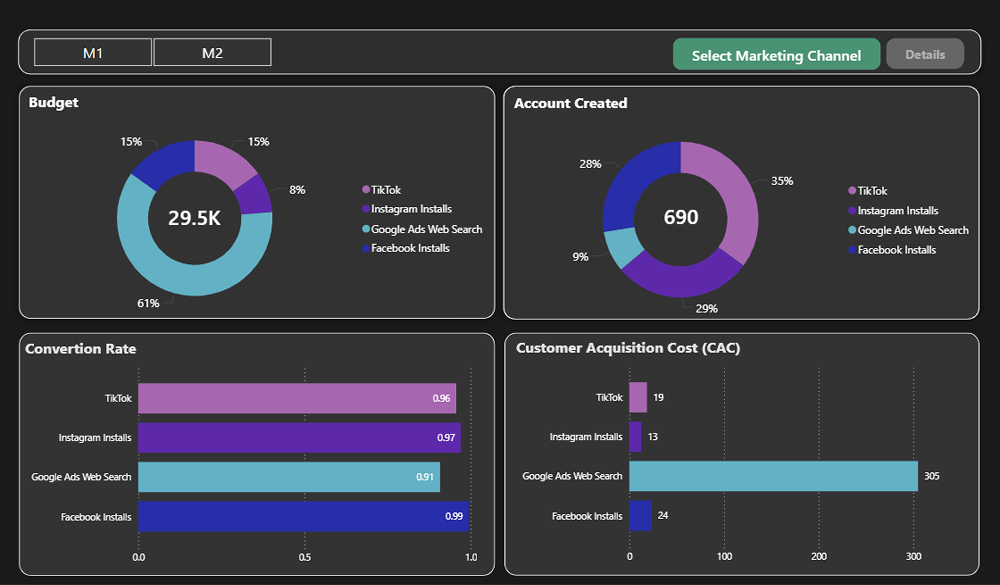

# Marketing Performance Dashboard


## Project Overview

End-to-end BI case study analyzing marketing campaign performance using SQL Server and Power BI.

The goal of this project is to analyze marketing funnel performance, channel efficiency, customer acquisition cost, and budget allocation.

## Technologies Used

- SQL Server
- Power BI
- Excel
- SQL Analytics
- Business Intelligence


## Business Context

Marketing teams invest significant budgets across multiple acquisition channels, but determining which channels deliver the highest value requires more than tracking total conversions.

This project analyzes event-level marketing data to evaluate user behavior throughout the acquisition funnel, compare channel performance, and measure customer acquisition efficiency. The analysis combines user tracking events with marketing budget data to identify conversion bottlenecks, optimize spending, and support data-driven marketing decisions.

## Key Business Questions

The dashboard was designed to answer the following business questions:

- How should raw tracking events be consolidated into a reliable user-level dataset?
- How many users progress through each stage of the marketing funnel?
- At which funnel stage do the highest user drop-offs occur?
- Which marketing channel delivers the best acquisition efficiency?
- Which channel has the highest Customer Acquisition Cost (CAC)?
- How should future marketing budgets be allocated based on performance?

## Dataset

The dataset contains marketing tracking events and campaign budget information used to evaluate acquisition performance across multiple marketing channels.

It includes:

- Event-based user tracking data
- Marketing channel information (Facebook, Instagram, TikTok, and Google Ads)
- Marketing budget by reporting period
- User journey events across the signup funnel
- Two reporting periods:
  - **M1:** 01–14 October **M2:** 15–31 October


The data was designed to simulate a real-world digital marketing analytics environment for business intelligence reporting.

## Data Preparation & Quality Checks

The raw marketing tracking data was imported into SQL Server for cleaning, validation, and analysis.

The data preparation process included:

* Importing Excel tracking data into SQL Server
* Checking duplicate user records
* Identifying missing or invalid User Keys
* Validating event sequences within the user journey
* Applying funnel logic to create a reliable user-level dataset

### Data Quality Results

| Validation Check               | Result |
| ------------------------------ | -----: |
| Total Users                    |  3,731 |
| Users without valid User Key   |    807 |
| Invalid event sequences        |    743 |
| Duplicate User Key cases       |      1 |
| Valid users used for dashboard |  2,180 |

Only validated users were included in the final dashboard analysis to ensure accurate reporting of funnel and channel performance.


## Event Funnel

The analysis follows the complete user acquisition journey from initial signup interaction to completed identity verification.

The funnel consists of four key stages:

1. Signup Started
2. Signup Finished
3. Email Verified
4. ID Verification Finished

Each event was validated and consolidated at the user level to measure conversion rates and identify major drop-off points throughout the acquisition process.

## KPI Definitions

### Customer Acquisition Cost (CAC)

Measures the marketing cost required to acquire one converted customer.

**Formula:**  CAC = Marketing Spend / Number of Acquired Customers

### Funnel Conversion Rate

Measures the percentage of users who successfully move through the acquisition funnel.

**Formula:**  Completed Funnel Users / Started Funnel Users

### Account Created Rate

Measures the percentage of users who complete the signup process after starting registration.

**Formula:**  Signup Finished Users / Signup Started Users

### Drop-off Rate

Measures the percentage of users lost between two consecutive funnel stages.

**Formula:**  Users Lost Between Steps / Previous Funnel Step Users

## SQL Solution

SQL Server was used to transform raw marketing tracking events into a structured dataset for funnel and channel performance analysis.

The SQL analysis included:

* Data quality validation
* User-level event consolidation
* Funnel stage calculation
* Marketing channel performance analysis
* Customer Acquisition Cost (CAC) calculation
* Conversion rate analysis

The project uses analytical SQL techniques including:

* Common Table Expressions (CTEs)
* SELECT DISTINCT for user-level consolidation
* GROUP BY and HAVING for aggregation and validation checks
* CASE statements for funnel logic
* UNION for combining analytical datasets
* MIN/MAX timestamp functions to validate event sequences
* Filtering and conditional logic

These queries were designed to clean tracking data, validate user journeys, calculate funnel metrics, and prepare reliable datasets for Power BI reporting.


## Power BI Dashboard

The Power BI dashboard was developed to analyze marketing channel performance, user funnel progression, and customer acquisition efficiency.

The dashboard consists of two main pages:

### Page 1 — Marketing Overview

Includes:

* Marketing budget distribution by channel
* Customer Acquisition Cost (CAC)
* Account Created Rate
* Funnel Conversion Rate
* Channel performance comparison
* M1/M2 period filtering

### Page 2 — Channel Detail Analysis

Includes:

* Channel-specific funnel analysis
* Event-based user conversion funnel
* Cumulative conversion trend
* Budget allocation analysis
* Signup completion distribution
* Channel comparison across Facebook, Instagram, TikTok, and Google Ads




## Business Insights & Recommendations

### 1.

**Recommendation**

---

### 2.

**Recommendation**

---

### Overall Business Recommendation

## How to Explore This Project

To explore this project:

1. Review the SQL scripts in the `sql/` folder to understand the data preparation and analysis logic.
2. Open the Power BI file from the `powerbi/` folder to interact with the dashboard.
3. Review dashboard screenshots and visual documentation in the `images/` folder.

## Repository Structure

```text
sales-analytics-dashboard
│
├── README.md
├── images/
├── sql/
├── powerbi/
└── docs/
```

## Data Privacy

The dataset used in this project was generated from scratch using AI-assisted data generation.

The data is synthetic and created for educational and portfolio purposes. It does not contain any real customer information or personally identifiable data (PII).

